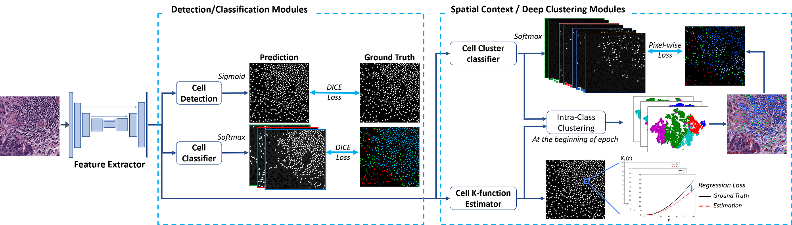

# MCSpatNet
### Repository for Multi-Class Cell Detection Using Spatial Context Representation, ICCV 2021 ###

[**Shahira Abousamra, David Belinsky, John Van Arnam, Felicia Allard, Eric Yee, Rajarsi Gupta, Tahsin Kurc, Dimitris Samaras, Joel Saltz, Chao Chen, Multi-Class Cell Detection Using Spatial Context Representation, ICCV 2021.**](https://arxiv.org/pdf/2110.04886.pdf)

<figure>
  

 
  <figcaption style="font-weight:bold;text-align:center">Multi-Class Spatial Network (MCSpatNet)</figcaption>

</figure>

 
  
  
  
- **Environment set up**: 
refer to `environment.md`.

- **Generate ground truth labels**: refer to `data_preprocessing.md`.

- **Model training and evaluation**: refer to `train_and_test.md`.

- **Pre-processed datasets**: available under `datasets`. Includes:  
CoNSeP dataset:  
S. Graham, Q. D. Vu, S. E. A. Raza, A. Azam, Y-W. Tsang, J. T. Kwak and N. Rajpoot. "HoVer-Net: Simultaneous Segmentation and Classification of Nuclei in Multi-Tissue Histology Images." Medical Image Analysis, Sept. 2019 .(https://warwick.ac.uk/fac/cross_fac/tia/data/hovernet/)    
BRCA-M2C dataset:  
The accompanying dataset to our paper:  
S. Abousamra, D. Belinsky, J. V. Arnam, F. Allard, E. Yee, R. Gupta, T. Kurc, D. Samaras, J. Saltz, C. Chen, "Multi-Class Cell Detection Using Spatial Context Representation", ICCV 2021.  
(https://github.com/TopoXLab/Dataset-BRCA-M2C)

- **Trained models**: available under `pretrained_models`.

- **Trained models test results**: available under `pretrained_results`.

### Citation ###
	@InProceedings{Abousamra_2021_ICCV,
    author    = {Abousamra, Shahira and Belinsky, David and Van Arnam, John and Allard, Felicia and Yee, Eric and Gupta, Rajarsi and Kurc, Tahsin and Samaras, Dimitris and Saltz, Joel and Chen, Chao},  
    title     = {Multi-Class Cell Detection Using Spatial Context Representation},  
    booktitle = {Proceedings of the IEEE/CVF International Conference on Computer Vision (ICCV)},  
    year      = {2021},  
	}
